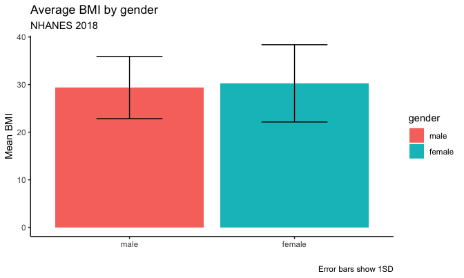
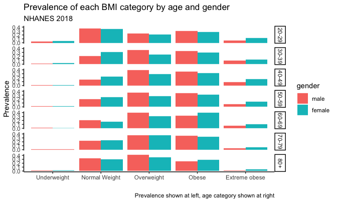
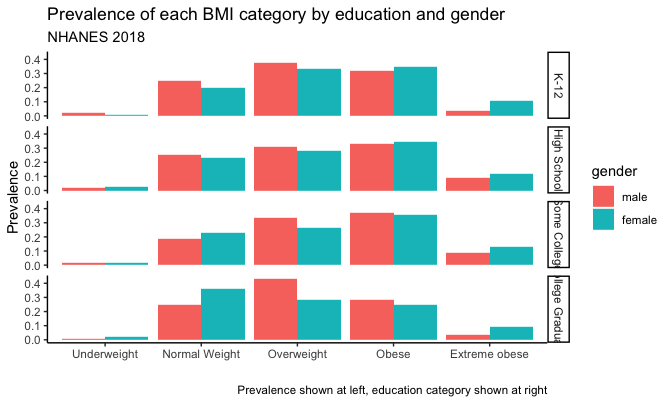

NHANES BMI Summary 2018
================
Rachel Tao
10/9/2021

I want to know if education was associated with obesity in 2018. To do
this, I’ll use the NHANES data from the 2017-2018 cycle. Since I think
that gender, age, and race are probably also associated with obesity, I
will look at those variables too.

For this analysis, I am using R because it has excellent data wrangling
capabilities, and RMarkdown allows for the efficient generation of a
digestible yet informative report. Although NHANES data are in \*.xpt
file format, which are meant to be read into SAS, I still believe that R
is preferable because so much data wrangling is needed for NHANES data,
and R has more tools for efficient data wrangling than SAS. R is also
open-source, which allows for greater reproducibility. I have created a
git repository for this project in github for version control. I could
use github to share my code publicly, allowing for others to learn from
what I am doing, and for the possibility that someone might see my code
and make suggestions for how I can improve it. Github also allows for
code sharing among team-members, which is essential for any health
analysis, though privacy concerns must be taken into account when using
Github.

``` r
library(tidyverse)
```

    ## ── Attaching packages ─────────────────────────────────────── tidyverse 1.3.1 ──

    ## ✓ ggplot2 3.3.3     ✓ purrr   0.3.4
    ## ✓ tibble  3.1.2     ✓ dplyr   1.0.6
    ## ✓ tidyr   1.1.3     ✓ stringr 1.4.0
    ## ✓ readr   1.4.0     ✓ forcats 0.5.1

    ## ── Conflicts ────────────────────────────────────────── tidyverse_conflicts() ──
    ## x dplyr::filter() masks stats::filter()
    ## x dplyr::lag()    masks stats::lag()

``` r
library(tidylog)
```

    ## 
    ## Attaching package: 'tidylog'

    ## The following objects are masked from 'package:dplyr':
    ## 
    ##     add_count, add_tally, anti_join, count, distinct, distinct_all,
    ##     distinct_at, distinct_if, filter, filter_all, filter_at, filter_if,
    ##     full_join, group_by, group_by_all, group_by_at, group_by_if,
    ##     inner_join, left_join, mutate, mutate_all, mutate_at, mutate_if,
    ##     relocate, rename, rename_all, rename_at, rename_if, rename_with,
    ##     right_join, sample_frac, sample_n, select, select_all, select_at,
    ##     select_if, semi_join, slice, slice_head, slice_max, slice_min,
    ##     slice_sample, slice_tail, summarise, summarise_all, summarise_at,
    ##     summarise_if, summarize, summarize_all, summarize_at, summarize_if,
    ##     tally, top_frac, top_n, transmute, transmute_all, transmute_at,
    ##     transmute_if, ungroup

    ## The following objects are masked from 'package:tidyr':
    ## 
    ##     drop_na, fill, gather, pivot_longer, pivot_wider, replace_na,
    ##     spread, uncount

    ## The following object is masked from 'package:stats':
    ## 
    ##     filter

``` r
library(SASxport)
library(kableExtra) 
```

    ## 
    ## Attaching package: 'kableExtra'

    ## The following object is masked from 'package:dplyr':
    ## 
    ##     group_rows

``` r
library(ggplot2)
library(aod)

knitr::opts_chunk$set(
    fig.asp = 0.6,
    message = FALSE,
    warning = FALSE,
    out.width = "90%"
)
```

## Load in NHANES datasets

``` r
BMI_data <- read.xport("./BMX_J.XPT") %>% 
  select(
    SEQN, 
    BMDSTATS,
    BMXWT,
    BMIWT,
    BMXHT,
    BMIHT
  ) %>% 
  rename(
    completeness = BMDSTATS,
    weight_kg = BMXWT,
    weight_notes = BMIWT,
    height_cm = BMXHT,
    height_notes = BMIHT
  )

nrow(BMI_data)
```

    ## [1] 8704

``` r
demo_data <- read.xport("./DEMO_J.XPT") %>% 
  select(
    SEQN,
    SDDSRVYR,
    RIDSTATR,
    RIAGENDR,
    RIDAGEYR,
    WTMEC2YR,
    SDMVPSU,
    SDMVSTRA,
    RIDEXPRG,
    RIDRETH3,
    DMDEDUC2
  ) %>% 
  rename(
    release_cycle = SDDSRVYR,
    examined = RIDSTATR,
    gender = RIAGENDR,
    age_years = RIDAGEYR,
    exam_weight_2yr = WTMEC2YR,
    pseudo_PSU = SDMVPSU,
    pseudo_stratum = SDMVSTRA,
    pregnant = RIDEXPRG,
    race = RIDRETH3,
    education = DMDEDUC2
  )

nrow(demo_data)
```

    ## [1] 9254

## Merge data into one dataset and do preliminary cleaning to look at data

``` r
nhanes_bmi_full <- inner_join(demo_data, BMI_data, by = "SEQN")

labelled::generate_dictionary(nhanes_bmi_full)
```

    ##  pos variable        label                               col_type values
    ##  1   SEQN            Respondent sequence number          labelled       
    ##  2   release_cycle   Data release cycle                  labelled       
    ##  3   examined        Interview/Examination status        labelled       
    ##  4   gender          Gender                              labelled       
    ##  5   age_years       Age in years at screening           labelled       
    ##  6   exam_weight_2yr Full sample 2 year MEC exam weight  labelled       
    ##  7   pseudo_PSU      Masked variance pseudo-PSU          labelled       
    ##  8   pseudo_stratum  Masked variance pseudo-stratum      labelled       
    ##  9   pregnant        Pregnancy status at exam            labelled       
    ##  10  race            Race/Hispanic origin w/ NH Asian    labelled       
    ##  11  education       Education level - Adults 20+        labelled       
    ##  12  completeness    Body Measures Component Status Code labelled       
    ##  13  weight_kg       Weight (kg)                         labelled       
    ##  14  weight_notes    Weight Comment                      labelled       
    ##  15  height_cm       Standing Height (cm)                labelled       
    ##  16  height_notes    Standing Height Comment             labelled

``` r
nhanes_bmi_full <- nhanes_bmi_full %>% 
  as_tibble() %>% 
  mutate(
    examined = as_factor(examined),
    examined = fct_recode(examined, 
                          yes = "2", 
                          no = "1" 
                          ),
    gender = as_factor(gender),
    gender = fct_recode(gender, 
                        female = "2", 
                        male = "1"
                        ),
    completeness = as_factor(completeness),
    completeness = fct_recode(completeness, # recode body measurement completeness
                              complete = "1",
                              ht_wt_only = "2",
                              other_partial = "3",
                              no_measures = "4"
                              ),
    weight_notes = as_factor(weight_notes),
    weight_notes = fct_recode(weight_notes,
                              no_measure = "1",
                              clothing = "3",
                              medical_appliance = "4"
                              ),
    height_notes = as_factor(height_notes),
    height_notes = fct_recode(height_notes,
                              no_measure = "1",
                              not_straight = "3"
                              ),
    pregnant = as_factor(pregnant),
    pregnant = fct_recode(pregnant, 
                           pregnant = "1", 
                           not_pregnant = "2", 
                           unsure = "3"
                          ),
    race = as_factor(race),
    race = fct_recode(race,
                      hispanic = "1", # coding "Mexican American" as hispanic
                      hispanic = "2", # coding "other Hispanic" as hispanic
                      white = "3", # coding "non-Hispanic white" as white
                      black = "4", # coding "non-Hispanic Black" as black
                      asian = "6", # coding "non-Hispanic Asian" as asian
                      other = "7" # coding "Other - Including Multi-racial" as other
                      ),
    education = as_factor(education),
    education = fct_recode(education,
                           K_12 = "1", # coding <9th grade as K_12
                           K_12 = "2", # coding 9th-11th grade as K_12
                           high_school = "3", # coding high school grad as high_school
                           some_college = "4", # coding some college as some_college
                           college_grad = "5", # coding college graduate or higher as college_grad
                           refused = "7",
                           unsure = "9"
                           )
  )

summary(nhanes_bmi_full)
```

    ##       SEQN        release_cycle examined      gender       age_years    
    ##  Min.   : 93703   Min.   :10    yes:8704   male  :4273   Min.   : 0.00  
    ##  1st Qu.: 96001   1st Qu.:10               female:4431   1st Qu.:11.00  
    ##  Median : 98308   Median :10                             Median :31.00  
    ##  Mean   : 98315   Mean   :10                             Mean   :34.44  
    ##  3rd Qu.:100625   3rd Qu.:10                             3rd Qu.:58.00  
    ##  Max.   :102956   Max.   :10                             Max.   :80.00  
    ##                                                                         
    ##  exam_weight_2yr    pseudo_PSU    pseudo_stratum         pregnant   
    ##  Min.   :  2566   Min.   :1.000   Min.   :134    pregnant    :  55  
    ##  1st Qu.: 13763   1st Qu.:1.000   1st Qu.:137    not_pregnant: 966  
    ##  Median : 22410   Median :2.000   Median :141    unsure      :  36  
    ##  Mean   : 36862   Mean   :1.514   Mean   :141    NA's        :7647  
    ##  3rd Qu.: 39256   3rd Qu.:2.000   3rd Qu.:144                       
    ##  Max.   :419763   Max.   :2.000   Max.   :148                       
    ##                                                                     
    ##        race             education           completeness    weight_kg     
    ##  hispanic:2071   K_12        :1052   complete     :8019   Min.   :  3.20  
    ##  white   :2931   high_school :1251   ht_wt_only   : 295   1st Qu.: 43.10  
    ##  black   :2010   some_college:1689   other_partial: 283   Median : 67.75  
    ##  asian   :1086   college_grad:1261   no_measures  : 107   Mean   : 65.14  
    ##  other   : 606   refused     :   2                        3rd Qu.: 85.60  
    ##                  unsure      :  10                        Max.   :242.60  
    ##                  NA's        :3439                        NA's   :124     
    ##             weight_notes    height_cm           height_notes 
    ##  no_measure       :  11   Min.   : 78.3   no_measure  :  32  
    ##  clothing         : 382   1st Qu.:151.4   not_straight:  67  
    ##  medical_appliance:  23   Median :161.9   NA's        :8605  
    ##  NA's             :8288   Mean   :156.6                      
    ##                           3rd Qu.:171.2                      
    ##                           Max.   :197.7                      
    ##                           NA's   :688

Data summary:

-   It looks like all of our data are in the correct release cycle (year
    10, 2017-2018 year)
-   As expected, everyone in our dataset was both examined and
    interviewed
-   No missing gender values
-   No missing age, we will need to restrict to 20 and above since we
    have data for those under 20
-   According to the documentation, we only have pregnancy data for
    females 20-44, and of those only 55 were pregnant and 36 were
    unsure.
-   for both race and education, it looks like we lost a few
    observations from people who were included in the demographics
    dataset but not in the body measurements dataset. Given that, these
    values look reasonable.
-   We have a lot of missing values for education. Let’s look at this
    further once we’ve removed other observations we don’t need, since
    it’s likely that this is because the education categories only apply
    to ages 20+
-   Most of the BMI data are complete, but there are 283 people who had
    partial measures other than “height and weight only” and 107 people
    who did not have any measures
-   Weight data look reasonable given that children are included, with
    124 missing values
-   Height data look reasonable given that children are included, with
    688 missing values. Unclear why there are so many more missing
    values compared to the sum of other\_partial and no\_measures in the
    “completeness” variable
-   It will be important to consider the weight and height notes when we
    do the analysis, and it may be a good idea to do a sensitivity
    analysis both including and excluding those with clothing and
    medical appliances, as well as those who were not standing straight

Note: In a more in-depth analysis we would use exam\_weight\_year2,
pseudo\_PSU, and pseudo\_stratum to account for specifics of the NHANES
study design. I have therefore included them in the main dataset for
this analysis. However, I will not do this additional analysis here, and
will simply state that in order to interpret NHANES data accurately, we
would in a real analysis want to use these variables. I will therefore
delete these variables in the future steps.

## Taking a closer look at the data and missingness

``` r
nhanes_bmi <- nhanes_bmi_full %>% 
  select(-release_cycle, -examined, -exam_weight_2yr, -pseudo_PSU, -pseudo_stratum) %>% 
  filter(
    age_years >= 20, # remove anyone less than age 20
    pregnant %in% c("not_pregnant", "unsure", NA), # remove pregnant people, since BMI is not comparable with non-pregnant people
    education %in% c("K_12", "high_school", "some_college", "college_grad", NA)
  )

summary(nhanes_bmi)
```

    ##       SEQN           gender       age_years            pregnant   
    ##  Min.   : 93705   male  :2536   Min.   :20.0   pregnant    :   0  
    ##  1st Qu.: 95962   female:2662   1st Qu.:36.0   not_pregnant: 965  
    ##  Median : 98272                 Median :53.0   unsure      :  36  
    ##  Mean   : 98285                 Mean   :51.6   NA's        :4197  
    ##  3rd Qu.:100622                 3rd Qu.:65.0                      
    ##  Max.   :102956                 Max.   :80.0                      
    ##                                                                   
    ##        race             education           completeness    weight_kg     
    ##  hispanic:1173   K_12        :1040   complete     :4797   Min.   : 32.60  
    ##  white   :1792   high_school :1240   ht_wt_only   : 171   1st Qu.: 67.00  
    ##  black   :1222   some_college:1669   other_partial: 164   Median : 79.10  
    ##  asian   : 747   college_grad:1249   no_measures  :  66   Mean   : 82.84  
    ##  other   : 264   refused     :   0                        3rd Qu.: 94.83  
    ##                  unsure      :   0                        Max.   :242.60  
    ##                                                           NA's   :78      
    ##             weight_notes    height_cm           height_notes 
    ##  no_measure       :   7   Min.   :138.3   no_measure  :  12  
    ##  clothing         : 193   1st Qu.:158.8   not_straight:  63  
    ##  medical_appliance:  14   Median :165.9   NA's        :5123  
    ##  NA's             :4984   Mean   :166.3                      
    ##                           3rd Qu.:173.6                      
    ##                           Max.   :197.7                      
    ##                           NA's   :78

``` r
# It looks like after filtering out children from our dataset, we have no missing
# values for education.

nhanes_bmi %>% 
  filter(completeness != "complete") %>% 
  select(completeness, weight_notes, height_notes, weight_kg, height_cm) %>% 
  arrange(completeness, height_notes, weight_notes) # %>%
```

    ## # A tibble: 401 x 5
    ##    completeness weight_notes height_notes weight_kg  height_cm 
    ##    <fct>        <fct>        <fct>        <labelled> <labelled>
    ##  1 ht_wt_only   clothing     not_straight  75.2      149.3     
    ##  2 ht_wt_only   clothing     not_straight  71.1      166.3     
    ##  3 ht_wt_only   clothing     not_straight  78.0      172.2     
    ##  4 ht_wt_only   clothing     not_straight 170.8      174.7     
    ##  5 ht_wt_only   clothing     not_straight  79.2      155.1     
    ##  6 ht_wt_only   clothing     not_straight  66.7      156.8     
    ##  7 ht_wt_only   clothing     not_straight  84.1      152.0     
    ##  8 ht_wt_only   clothing     not_straight  79.5      154.9     
    ##  9 ht_wt_only   clothing     not_straight  60.4      172.2     
    ## 10 ht_wt_only   clothing     not_straight 219.6      161.3     
    ## # … with 391 more rows

``` r
  # view()

# looking at each category of the variable "completeness":
# looks like height_weight_only does have measures for both weight and height for all values
# several other_partial are missing height or weight, but not all
# no_measures is accurate

# therefore, we can omit all observations where completeness = no_measures
# we can keep all observations where completeness = height_weight_only
# we should keep other_partial and further omit based on weight_notes and height_notes

# now let's check to see if things are adding up

nhanes_bmi %>% 
  group_by(completeness, weight_notes, height_notes) %>% 
  summarize(count = n())
```

    ## # A tibble: 20 x 4
    ## # Groups:   completeness, weight_notes [10]
    ##    completeness  weight_notes      height_notes count
    ##    <fct>         <fct>             <fct>        <int>
    ##  1 complete      clothing          <NA>            17
    ##  2 complete      medical_appliance not_straight     1
    ##  3 complete      medical_appliance <NA>             8
    ##  4 complete      <NA>              not_straight    34
    ##  5 complete      <NA>              <NA>          4737
    ##  6 ht_wt_only    clothing          not_straight    10
    ##  7 ht_wt_only    clothing          <NA>           130
    ##  8 ht_wt_only    <NA>              not_straight     4
    ##  9 ht_wt_only    <NA>              <NA>            27
    ## 10 other_partial no_measure        no_measure       1
    ## 11 other_partial no_measure        <NA>             6
    ## 12 other_partial clothing          no_measure       4
    ## 13 other_partial clothing          not_straight     2
    ## 14 other_partial clothing          <NA>            30
    ## 15 other_partial medical_appliance not_straight     2
    ## 16 other_partial medical_appliance <NA>             3
    ## 17 other_partial <NA>              no_measure       7
    ## 18 other_partial <NA>              not_straight    10
    ## 19 other_partial <NA>              <NA>            99
    ## 20 no_measures   <NA>              <NA>            66

``` r
# looks like all 78 NAs for height are accounted for with a combination of height_notes and completeness
# only 73 of the 78 NAs for weight are accounted for with a combination of weight_notes and completeness
# let's see where the other 5 might be:

nhanes_bmi %>% 
  filter(
    is.na(weight_kg),
    weight_notes %in% c("clothing", "medical_appliance", NA),
    completeness %in% c("complete", "ht_wt_only", "other_partial", NA)) %>% 
  select(completeness, weight_notes, weight_kg)
```

    ## # A tibble: 5 x 3
    ##   completeness  weight_notes weight_kg 
    ##   <fct>         <fct>        <labelled>
    ## 1 other_partial <NA>         NA        
    ## 2 other_partial <NA>         NA        
    ## 3 other_partial <NA>         NA        
    ## 4 other_partial <NA>         NA        
    ## 5 other_partial <NA>         NA

Based on the above, I feel comfortable assuming that heights and weights
in the “complete” and “height\_weight\_only” categories of completeness
are valid entries. I can also see that there are only five missing
values for weight that are not explained, and these are all in the
“other\_partial” category of completeness. Therefore, I will omit
observations in the “no\_measures” category of completion, observations
in the “no\_measure” category of weight\_notes and height\_notes, as
well as all other observations that have missing values for height or
weight, without worrying excessively about unexplained missingness.

I will also choose to omit observations in the “medical\_appliance”
category of weight\_notes, as medical appliances can be quite heavy, and
this could lead to measurement inaccuracy/non-comparability. I will
retain observations in the “clothing” category of weight\_notes and the
“not\_straight” category of height\_notes, because I do not think these
would contribute as heavily to inaccuracy as medical appliances. In a
more in-depth analysis, I would want to speak with someone who might
know more than me about how much these could contribute to inaccuracy.

## Data Cleaning and New Variable Creation

``` r
nhanes_bmi <- nhanes_bmi %>% 
  filter(
    completeness %in% c("complete", "ht_wt_only", "other_partial", NA),
    weight_notes %in% c("clothing", NA),
    height_notes %in% c("not_straight", NA),
  ) %>% 
  drop_na(weight_kg, height_cm) %>% # drop missing obs from weight and height
  select(-pregnant, -completeness, -weight_notes, -height_notes) %>% #remove unneeded variables
  mutate(
    height_m = height_cm*0.01, # put height into meters to calculate BMI
    bmi = weight_kg/(height_m)^2, # calculate BMI
    bmi_cat = cut(bmi, 
                  breaks = c(0, 18.5, 25, 30, 40, Inf), 
                  labels = c("underweight", "normal_weight", "overweight", "obese", "extreme_obese"),
                  right = FALSE), # categorize BMI
    age_cat = cut(age_years,
                  breaks = c(19, 30, 40, 50, 60, 70, 80, Inf),
                  labels = c("20-29", "30-39", "40-49", "50-59", "60-69", "70-79", "80+"), # create age categories
                  right = FALSE)
  )

summary(nhanes_bmi)
```

    ##       SEQN           gender       age_years           race     
    ##  Min.   : 93705   male  :2479   Min.   :20.00   hispanic:1147  
    ##  1st Qu.: 95951   female:2617   1st Qu.:36.00   white   :1754  
    ##  Median : 98277                 Median :53.00   black   :1198  
    ##  Mean   : 98284                 Mean   :51.41   asian   : 738  
    ##  3rd Qu.:100621                 3rd Qu.:65.00   other   : 259  
    ##  Max.   :102956                 Max.   :80.00                  
    ##                                                                
    ##         education      weight_kg        height_cm        height_m    
    ##  K_12        :1007   Min.   : 32.60   Min.   :138.3   Min.   :1.383  
    ##  high_school :1218   1st Qu.: 67.00   1st Qu.:158.8   1st Qu.:1.588  
    ##  some_college:1643   Median : 79.10   Median :165.9   Median :1.659  
    ##  college_grad:1228   Mean   : 82.86   Mean   :166.3   Mean   :1.663  
    ##  refused     :   0   3rd Qu.: 94.83   3rd Qu.:173.6   3rd Qu.:1.736  
    ##  unsure      :   0   Max.   :242.60   Max.   :197.7   Max.   :1.977  
    ##                                                                      
    ##       bmi                 bmi_cat      age_cat    
    ##  Min.   :14.20   underweight  :  83   20-29: 742  
    ##  1st Qu.:24.78   normal_weight:1250   30-39: 779  
    ##  Median :28.62   overweight   :1640   40-49: 760  
    ##  Mean   :29.83   obese        :1664   50-59: 870  
    ##  3rd Qu.:33.54   extreme_obese: 459   60-69:1038  
    ##  Max.   :86.16                        70-79: 558  
    ##                                       80+  : 349

## Let’s take a look at our data, now that it’s cleaned

``` r
mean_bmi_gender <- nhanes_bmi %>% 
  group_by(gender) %>% 
  summarize(mean = mean(bmi),
            sd = sd(bmi))

gender_tot <- nhanes_bmi %>% 
  group_by(gender) %>% 
  summarize(total = n()) 

bmi_cat_summary <- nhanes_bmi %>% 
  group_by(gender, bmi_cat) %>% 
  summarize(count = n()) %>% 
  left_join(gender_tot) %>% 
  mutate(
    prevalence = count/total
  )

gender_age_tot <- nhanes_bmi %>% 
  group_by(gender, age_cat) %>% 
  summarize(total = n())

bmi_cat_age_summary <- nhanes_bmi %>% 
  group_by(gender, age_cat, bmi_cat) %>% 
  summarize(count = n()) %>% 
  right_join(gender_age_tot) %>% 
  mutate(
    prevalence = count/total
  )

gender_race_tot <- nhanes_bmi %>% 
  group_by(gender, race) %>% 
  summarize(total = n())

bmi_cat_race_summary <- nhanes_bmi %>% 
  select(-age_cat) %>% 
  group_by(gender, race, bmi_cat) %>% 
  summarize(count = n()) %>% 
  right_join(gender_race_tot) %>% 
  mutate(
    prevalence = count/total
  )

gender_education_tot <- nhanes_bmi %>% 
  group_by(gender, education) %>% 
  summarize(total = n())

bmi_cat_education_summary <- nhanes_bmi %>% 
  group_by(gender, education, bmi_cat) %>% 
  summarize(count = n()) %>% 
  right_join(gender_education_tot) %>% 
  mutate(
    prevalence = count/total
  )
```

## Let’s make it nicer to look at

``` r
mean_bmi_gender %>% ggplot(aes(x = gender, y = mean, fill = gender)) +
  geom_bar(stat = "identity") +
  geom_errorbar(aes(ymin = mean - sd, ymax = mean + sd), width = 0.4) +
  theme_classic() +
  xlab("") +
  ylab("Mean BMI") +
  labs(
    title = "Average BMI by gender",
    subtitle = "NHANES 2018",
    caption = "Error bars show 1SD"
  )
```



``` r
bmi_cat_summary %>% 
  select(gender, bmi_cat, prevalence) %>% 
  mutate(
    prevalence = round(prevalence, digits = 3)
  ) %>% 
  pivot_wider(names_from = gender,
              values_from = prevalence) %>% 
  mutate(
    bmi_cat = fct_recode(bmi_cat,
    "Underweight" = "underweight",
    "Normal Weight" = "normal_weight",
    "Overweight" = "overweight",
    "Obese" = "obese",
    "Extreme obese" = "extreme_obese"
  )) %>% 
  rename("BMI Category" = bmi_cat,
         Male = male,
         Female = female) %>% 
  kable()
```

<table>
<thead>
<tr>
<th style="text-align:left;">
BMI Category
</th>
<th style="text-align:right;">
Male
</th>
<th style="text-align:right;">
Female
</th>
</tr>
</thead>
<tbody>
<tr>
<td style="text-align:left;">
Underweight
</td>
<td style="text-align:right;">
0.015
</td>
<td style="text-align:right;">
0.018
</td>
</tr>
<tr>
<td style="text-align:left;">
Normal Weight
</td>
<td style="text-align:right;">
0.232
</td>
<td style="text-align:right;">
0.258
</td>
</tr>
<tr>
<td style="text-align:left;">
Overweight
</td>
<td style="text-align:right;">
0.359
</td>
<td style="text-align:right;">
0.287
</td>
</tr>
<tr>
<td style="text-align:left;">
Obese
</td>
<td style="text-align:right;">
0.328
</td>
<td style="text-align:right;">
0.325
</td>
</tr>
<tr>
<td style="text-align:left;">
Extreme obese
</td>
<td style="text-align:right;">
0.066
</td>
<td style="text-align:right;">
0.113
</td>
</tr>
</tbody>
</table>

``` r
bmi_cat_race_summary %>% 
  select(gender, bmi_cat, race, prevalence) %>% 
  mutate(
    prevalence = round(prevalence, digits = 3)
  ) %>% 
  pivot_wider(names_from = gender,
              values_from = prevalence) %>% 
  # mutate_all(~replace(., is.na(.), 0)) %>% # we had one category with no people in it, so we will convert the NA to 0
  mutate(
    bmi_cat = fct_recode(
      bmi_cat,
      "Underweight" = "underweight",
      "Normal Weight" = "normal_weight",
      "Overweight" = "overweight",
      "Obese" = "obese",
      "Extreme obese" = "extreme_obese"),
    race = fct_recode(
      race,
      "Hispanic" = "hispanic",
      "White" = "white",
      "Black" = "black",
      "Asian" = "asian",
      "Other" = "other"
  )) %>% 
  rename("BMI Category" = bmi_cat,
         Male = male,
         Female = female,
         "Race Category" = race) %>% 
  kable()
```

<table>
<thead>
<tr>
<th style="text-align:left;">
BMI Category
</th>
<th style="text-align:left;">
Race Category
</th>
<th style="text-align:right;">
Male
</th>
<th style="text-align:right;">
Female
</th>
</tr>
</thead>
<tbody>
<tr>
<td style="text-align:left;">
Underweight
</td>
<td style="text-align:left;">
Hispanic
</td>
<td style="text-align:right;">
0.005
</td>
<td style="text-align:right;">
0.007
</td>
</tr>
<tr>
<td style="text-align:left;">
Normal Weight
</td>
<td style="text-align:left;">
Hispanic
</td>
<td style="text-align:right;">
0.128
</td>
<td style="text-align:right;">
0.178
</td>
</tr>
<tr>
<td style="text-align:left;">
Overweight
</td>
<td style="text-align:left;">
Hispanic
</td>
<td style="text-align:right;">
0.424
</td>
<td style="text-align:right;">
0.355
</td>
</tr>
<tr>
<td style="text-align:left;">
Obese
</td>
<td style="text-align:left;">
Hispanic
</td>
<td style="text-align:right;">
0.391
</td>
<td style="text-align:right;">
0.360
</td>
</tr>
<tr>
<td style="text-align:left;">
Extreme obese
</td>
<td style="text-align:left;">
Hispanic
</td>
<td style="text-align:right;">
0.051
</td>
<td style="text-align:right;">
0.100
</td>
</tr>
<tr>
<td style="text-align:left;">
Underweight
</td>
<td style="text-align:left;">
White
</td>
<td style="text-align:right;">
0.018
</td>
<td style="text-align:right;">
0.023
</td>
</tr>
<tr>
<td style="text-align:left;">
Normal Weight
</td>
<td style="text-align:left;">
White
</td>
<td style="text-align:right;">
0.220
</td>
<td style="text-align:right;">
0.268
</td>
</tr>
<tr>
<td style="text-align:left;">
Overweight
</td>
<td style="text-align:left;">
White
</td>
<td style="text-align:right;">
0.320
</td>
<td style="text-align:right;">
0.278
</td>
</tr>
<tr>
<td style="text-align:left;">
Obese
</td>
<td style="text-align:left;">
White
</td>
<td style="text-align:right;">
0.360
</td>
<td style="text-align:right;">
0.322
</td>
</tr>
<tr>
<td style="text-align:left;">
Extreme obese
</td>
<td style="text-align:left;">
White
</td>
<td style="text-align:right;">
0.081
</td>
<td style="text-align:right;">
0.110
</td>
</tr>
<tr>
<td style="text-align:left;">
Underweight
</td>
<td style="text-align:left;">
Black
</td>
<td style="text-align:right;">
0.023
</td>
<td style="text-align:right;">
0.016
</td>
</tr>
<tr>
<td style="text-align:left;">
Normal Weight
</td>
<td style="text-align:left;">
Black
</td>
<td style="text-align:right;">
0.271
</td>
<td style="text-align:right;">
0.168
</td>
</tr>
<tr>
<td style="text-align:left;">
Overweight
</td>
<td style="text-align:left;">
Black
</td>
<td style="text-align:right;">
0.306
</td>
<td style="text-align:right;">
0.233
</td>
</tr>
<tr>
<td style="text-align:left;">
Obese
</td>
<td style="text-align:left;">
Black
</td>
<td style="text-align:right;">
0.332
</td>
<td style="text-align:right;">
0.395
</td>
</tr>
<tr>
<td style="text-align:left;">
Extreme obese
</td>
<td style="text-align:left;">
Black
</td>
<td style="text-align:right;">
0.068
</td>
<td style="text-align:right;">
0.188
</td>
</tr>
<tr>
<td style="text-align:left;">
Underweight
</td>
<td style="text-align:left;">
Asian
</td>
<td style="text-align:right;">
0.009
</td>
<td style="text-align:right;">
0.030
</td>
</tr>
<tr>
<td style="text-align:left;">
Normal Weight
</td>
<td style="text-align:left;">
Asian
</td>
<td style="text-align:right;">
0.363
</td>
<td style="text-align:right;">
0.500
</td>
</tr>
<tr>
<td style="text-align:left;">
Overweight
</td>
<td style="text-align:left;">
Asian
</td>
<td style="text-align:right;">
0.468
</td>
<td style="text-align:right;">
0.310
</td>
</tr>
<tr>
<td style="text-align:left;">
Obese
</td>
<td style="text-align:left;">
Asian
</td>
<td style="text-align:right;">
0.140
</td>
<td style="text-align:right;">
0.145
</td>
</tr>
<tr>
<td style="text-align:left;">
Extreme obese
</td>
<td style="text-align:left;">
Asian
</td>
<td style="text-align:right;">
0.020
</td>
<td style="text-align:right;">
0.015
</td>
</tr>
<tr>
<td style="text-align:left;">
Underweight
</td>
<td style="text-align:left;">
Other
</td>
<td style="text-align:right;">
0.014
</td>
<td style="text-align:right;">
NA
</td>
</tr>
<tr>
<td style="text-align:left;">
Normal Weight
</td>
<td style="text-align:left;">
Other
</td>
<td style="text-align:right;">
0.229
</td>
<td style="text-align:right;">
0.261
</td>
</tr>
<tr>
<td style="text-align:left;">
Overweight
</td>
<td style="text-align:left;">
Other
</td>
<td style="text-align:right;">
0.299
</td>
<td style="text-align:right;">
0.209
</td>
</tr>
<tr>
<td style="text-align:left;">
Obese
</td>
<td style="text-align:left;">
Other
</td>
<td style="text-align:right;">
0.333
</td>
<td style="text-align:right;">
0.400
</td>
</tr>
<tr>
<td style="text-align:left;">
Extreme obese
</td>
<td style="text-align:left;">
Other
</td>
<td style="text-align:right;">
0.125
</td>
<td style="text-align:right;">
0.130
</td>
</tr>
</tbody>
</table>

``` r
bmi_cat_age_summary %>% 
  mutate(
     bmi_cat = fct_recode(
      bmi_cat,
      "Underweight" = "underweight",
      "Normal Weight" = "normal_weight",
      "Overweight" = "overweight",
      "Obese" = "obese",
      "Extreme obese" = "extreme_obese")) %>% 
  ggplot(aes(x = bmi_cat, y = prevalence)) +
  geom_col(aes(fill = gender), position = "dodge") +
  facet_grid(rows = vars(age_cat)) +
  xlab("") +
  ylab("Prevalence") +
  theme(strip.text = element_text(size = 5)) +
  theme_classic() +
  labs(
    title = "Prevalence of each BMI category by age and gender",
    subtitle = "NHANES 2018",
    caption = "Prevalence shown at left, age category shown at right"
  )
```



``` r
bmi_cat_education_summary %>% 
  mutate(
    education = fct_recode(
      education,
      "K-12" = "K_12",
      "High School" = "high_school",
      "Some College" = "some_college",
      "College Graduate" = "college_grad"),
    bmi_cat = fct_recode(
      bmi_cat,
      "Underweight" = "underweight",
      "Normal Weight" = "normal_weight",
      "Overweight" = "overweight",
      "Obese" = "obese",
      "Extreme obese" = "extreme_obese")) %>% 
  ggplot(aes(x = bmi_cat, y = prevalence)) +
  geom_col(aes(fill = gender), position = "dodge") +
  facet_grid(rows = vars(education)) +
  xlab("") +
  ylab("Prevalence") +
  theme_classic() +
  labs(
    title = "Prevalence of each BMI category by education and gender",
    subtitle = "NHANES 2018",
    caption = "Prevalence shown at left, education category shown at right"
  )
```



## Time to answer our research question:

Is education associated with obesity, adjusting for age, race, and
gender as potential confounders?

``` r
# I want to use logistic regression, so I will dichotomize my outcome variable,
# BMI, into "obese" versus "not obese"

nhanes_bmi <- nhanes_bmi %>% 
  mutate(
    obesity = if_else(bmi_cat %in% c("obese", "extreme_obese"), "obese", "not_obese"),
    obesity = as_factor(obesity),
    obesity = relevel(obesity, ref = "not_obese")
  )

logit_model <- glm(
  obesity ~ relevel(education, ref = "K_12") + relevel(race, ref = "white") + gender + age_years, 
  data = nhanes_bmi, 
  family = "binomial")

summary(logit_model)
```

    ## 
    ## Call:
    ## glm(formula = obesity ~ relevel(education, ref = "K_12") + relevel(race, 
    ##     ref = "white") + gender + age_years, family = "binomial", 
    ##     data = nhanes_bmi)
    ## 
    ## Deviance Residuals: 
    ##     Min       1Q   Median       3Q      Max  
    ## -1.2914  -1.0912  -0.5984   1.2250   2.0129  
    ## 
    ## Coefficients:
    ##                                               Estimate Std. Error z value
    ## (Intercept)                                  -0.378499   0.133951  -2.826
    ## relevel(education, ref = "K_12")high_school   0.137073   0.091281   1.502
    ## relevel(education, ref = "K_12")some_college  0.260282   0.086797   2.999
    ## relevel(education, ref = "K_12")college_grad -0.061290   0.096778  -0.633
    ## relevel(race, ref = "white")hispanic          0.079118   0.081579   0.970
    ## relevel(race, ref = "white")black             0.222168   0.075791   2.931
    ## relevel(race, ref = "white")asian            -1.335655   0.114642 -11.651
    ## relevel(race, ref = "white")other             0.204203   0.134434   1.519
    ## genderfemale                                  0.195159   0.058692   3.325
    ## age_years                                    -0.001757   0.001689  -1.040
    ##                                              Pr(>|z|)    
    ## (Intercept)                                  0.004718 ** 
    ## relevel(education, ref = "K_12")high_school  0.133185    
    ## relevel(education, ref = "K_12")some_college 0.002711 ** 
    ## relevel(education, ref = "K_12")college_grad 0.526539    
    ## relevel(race, ref = "white")hispanic         0.332128    
    ## relevel(race, ref = "white")black            0.003375 ** 
    ## relevel(race, ref = "white")asian             < 2e-16 ***
    ## relevel(race, ref = "white")other            0.128768    
    ## genderfemale                                 0.000884 ***
    ## age_years                                    0.298268    
    ## ---
    ## Signif. codes:  0 '***' 0.001 '**' 0.01 '*' 0.05 '.' 0.1 ' ' 1
    ## 
    ## (Dispersion parameter for binomial family taken to be 1)
    ## 
    ##     Null deviance: 6922.1  on 5095  degrees of freedom
    ## Residual deviance: 6618.5  on 5086  degrees of freedom
    ## AIC: 6638.5
    ## 
    ## Number of Fisher Scoring iterations: 4

``` r
# Based on the summary, we can see that some of the coefficients for our categorical
# variables look like they are statistically significant.
# but we cannot tell if this is meaningful without doing Likelihood Ratio Test

anova(object = logit_model, test = "Chisq")
```

    ## Analysis of Deviance Table
    ## 
    ## Model: binomial, link: logit
    ## 
    ## Response: obesity
    ## 
    ## Terms added sequentially (first to last)
    ## 
    ## 
    ##                                  Df Deviance Resid. Df Resid. Dev  Pr(>Chi)    
    ## NULL                                              5095     6922.1              
    ## relevel(education, ref = "K_12")  3   71.626      5092     6850.5 1.914e-15 ***
    ## relevel(race, ref = "white")      4  219.859      5088     6630.6 < 2.2e-16 ***
    ## gender                            1   11.090      5087     6619.5 0.0008681 ***
    ## age_years                         1    1.082      5086     6618.5 0.2982579    
    ## ---
    ## Signif. codes:  0 '***' 0.001 '**' 0.01 '*' 0.05 '.' 0.1 ' ' 1

Based on the LRT for our logistic model, we can conclude that in 2018,
there was a statistically significant association between education and
obesity, adjusting for race, age, and gender.

Now, let’s look at the values themselves:

``` r
# Extract coefficient matrix

coeff.mat <- summary(logit_model)$coef

# Extract the coefficient and standard error 

results <- tibble(
  education = c("High School", "Some College", "College Grad"),
  coeff = c(coeff.mat[2, 1], coeff.mat[3, 1], coeff.mat[4, 1]),
  se = c(coeff.mat[2, 2], coeff.mat[3, 2], coeff.mat[4, 2]))

# Exponentiate coefficient & CI
# since the logistic model transforms the outcome into the log of the odds
# we can compute the odds ratio by exponentiating the coefficients 
# in R exp(a) means 'e to the power of a'

results <- results %>% 
  mutate(
    OR = exp(coeff),
    lci.or = exp(coeff - 1.96*se),
    uci.or = exp(coeff + 1.96*se)
  )

results %>% kable()
```

<table>
<thead>
<tr>
<th style="text-align:left;">
education
</th>
<th style="text-align:right;">
coeff
</th>
<th style="text-align:right;">
se
</th>
<th style="text-align:right;">
OR
</th>
<th style="text-align:right;">
lci.or
</th>
<th style="text-align:right;">
uci.or
</th>
</tr>
</thead>
<tbody>
<tr>
<td style="text-align:left;">
High School
</td>
<td style="text-align:right;">
0.1370729
</td>
<td style="text-align:right;">
0.0912811
</td>
<td style="text-align:right;">
1.1469118
</td>
<td style="text-align:right;">
0.9590252
</td>
<td style="text-align:right;">
1.371608
</td>
</tr>
<tr>
<td style="text-align:left;">
Some College
</td>
<td style="text-align:right;">
0.2602820
</td>
<td style="text-align:right;">
0.0867973
</td>
<td style="text-align:right;">
1.2972959
</td>
<td style="text-align:right;">
1.0943486
</td>
<td style="text-align:right;">
1.537880
</td>
</tr>
<tr>
<td style="text-align:left;">
College Grad
</td>
<td style="text-align:right;">
-0.0612896
</td>
<td style="text-align:right;">
0.0967784
</td>
<td style="text-align:right;">
0.9405508
</td>
<td style="text-align:right;">
0.7780416
</td>
<td style="text-align:right;">
1.137003
</td>
</tr>
</tbody>
</table>

In 2018, adjusting for age, gender, and race, the odds of obesity were
30% higher in those who completed some college compared to those who did
not finish high school, on average. We are 95% confident that the odds
of obesity are between 9% and 54% higher in those who completed some
college, compared to those who did not finish high school.

Adjusting for age, gender, and race, the odds of obesity were 15% higher
for those who completed only high school compared with those who did not
finish high school, and 5.9% lower in those who completed college
compared to those who did not finish high school, on average. However,
these results were not statistically significant, and should be
interpreted with caution. We are 95% confident that the true odds ratio
comparing odds of obesity among those who finished high school versus
those who did not is between 0.959 and 1.37. We are 95% confident that
the true odds ratio comparing odds of obesity among those who finished
college versus those who did not is between 0.778 and 1.14.

These results indicate that there may be a relationship between
education and obesity, but this relationship may not be monotonic. It is
also possible that we did not fully capture the true associations due to
randomness, or limitations of this analysis. Here are some things I
might want to look at in future analyses in order to investigate this
relationship more carefully:

-   Incorporate sample weights according to NHANES study design
-   Look at multiple years of NHANES to see if there are trends over
    time, and also to increase statistical power through inclusion of
    more data
-   Sensitivity analyses with different definitions of obesity
    (including or excluding “overweight” category) and inclusion
    vs. exclusion of observations with notes such as “not straight” for
    height and “clothing” for weight
-   Considerations of other potential confounders, such as household
    income
